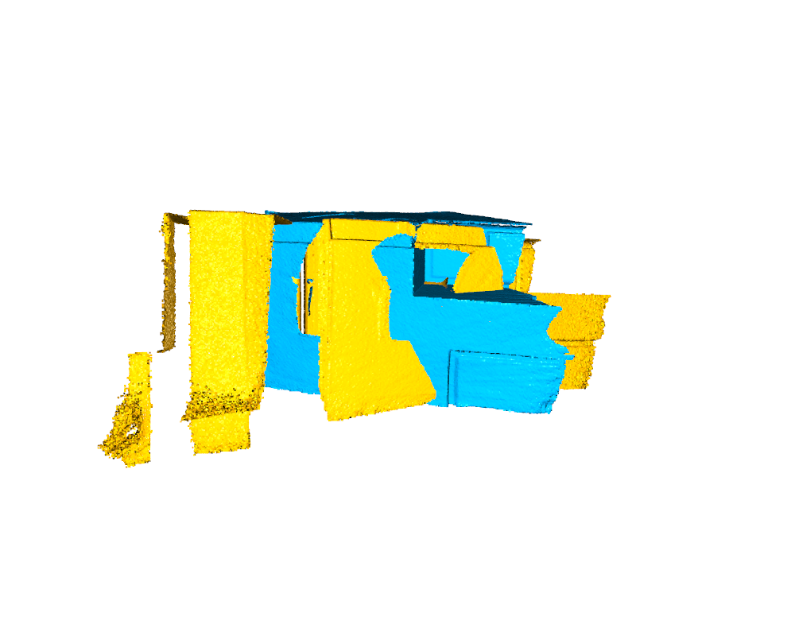
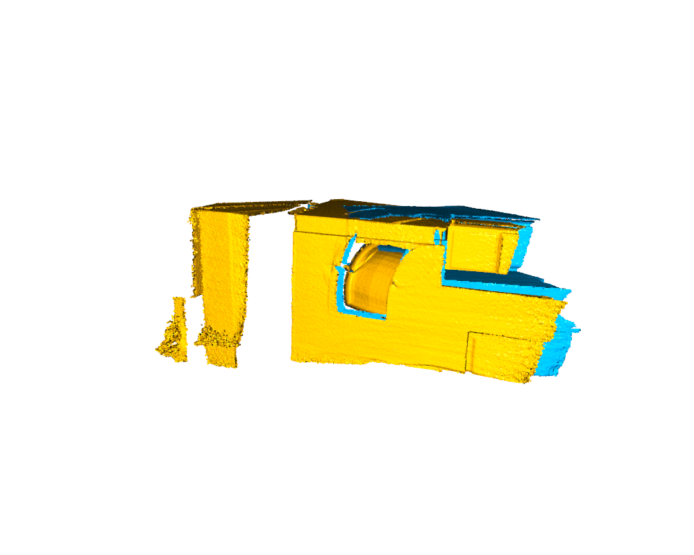
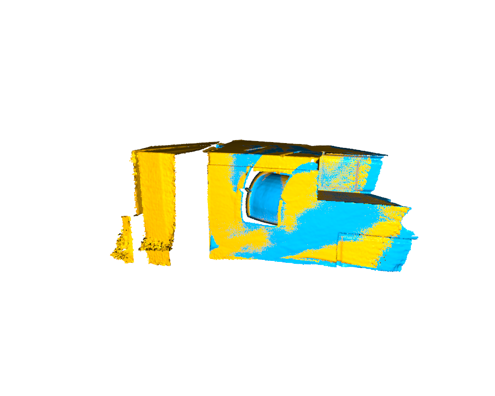

# Open3D 6D Pose Estimation Demo

本项目是一个基于 Open3D 的 6D 位姿估计学习项目，主要用于学习和实践三维点云配准中的基础流程。

项目使用 Open3D 官方 DemoICPPointClouds 真实点云数据，通过点云降采样、法向量估计、FPFH 特征提取、RANSAC 全局配准和 ICP 精配准，估计两帧点云之间的刚体变换关系，并输出 6D 位姿结果。

## Project Overview

6D Pose Estimation 表示估计目标在三维空间中的位置和姿态，通常包括：

- 3D Translation：x, y, z
- 3D Rotation：roll, pitch, yaw

在本项目中，点云之间的位姿关系通过一个 4×4 刚体变换矩阵表示：

```text
R  t
0  1
```

其中：

- `R` 表示旋转矩阵
- `t` 表示平移向量

## Pipeline

本项目主要流程如下：

1. 读取真实点云数据
2. 对源点云和目标点云进行体素降采样
3. 估计点云法向量
4. 提取 FPFH 局部几何特征
5. 使用 RANSAC 进行全局粗配准
6. 使用 ICP 进行局部精配准
7. 输出 4×4 位姿变换矩阵
8. 将旋转矩阵转换为 Roll / Pitch / Yaw 欧拉角
9. 保存配准结果、位姿结果和可视化图片

## Project Structure

```text
pose6d_open3d/
├── src/
│   └── main.py
├── data/
│   └── DemoICPPointClouds/
│       ├── cloud_bin_0.pcd
│       ├── cloud_bin_1.pcd
│       └── cloud_bin_2.pcd
├── results/
│   ├── before_registration.png
│   ├── after_ransac.png
│   ├── after_icp.png
│   ├── registration_report.txt
│   ├── ransac_transformation.txt
│   ├── icp_transformation.txt
│   ├── source_transformed_icp.pcd
│   └── merged_after_icp.pcd
├── README.md
└── requirements.txt
```

## Dataset

本项目使用 Open3D 官方提供的 DemoICPPointClouds 点云数据。

数据文件放置在：

```text
data/DemoICPPointClouds/
```

目录下包含：

```text
cloud_bin_0.pcd
cloud_bin_1.pcd
cloud_bin_2.pcd
```

本项目默认使用：

```text
cloud_bin_0.pcd 作为 source point cloud
cloud_bin_1.pcd 作为 target point cloud
```

## Environment

建议使用 Python 3.9 或以上版本。

安装依赖：

```bash
pip install -r requirements.txt
```

`requirements.txt` 内容如下：

```text
open3d
numpy
scipy
```

## Usage

在项目根目录下运行：

```bash
python src/main.py
```

程序运行后会依次显示：

```text
Before Registration
After RANSAC
After ICP
```

每个可视化窗口关闭后，程序会继续执行下一步。

运行结果会自动保存到：

```text
results/
```

## Output

程序会输出以下内容：

- RANSAC 配准结果
- ICP 精配准结果
- 4×4 位姿变换矩阵
- 平移向量 x, y, z
- Roll / Pitch / Yaw 欧拉角
- Fitness 指标
- Inlier RMSE 指标
- 各阶段运行时间

示例输出：

```text
========== Estimated 6D Pose ==========
x: 0.644515
y: 0.809726
z: -1.483818
roll:  17.883247 deg
pitch: -31.411905 deg
yaw:   -9.944086 deg

========== Metrics ==========
Fitness: 0.646254
Inlier RMSE: 0.009269
```

## Results

### Before Registration



### After RANSAC



### After ICP



## Method Details

### 1. Voxel Downsampling

为了降低点云规模并提高计算效率，本项目首先对原始点云进行体素降采样。

```python
pcd_down = pcd.voxel_down_sample(voxel_size)
```

### 2. Normal Estimation

FPFH 特征计算需要点云法向量，因此需要先估计每个点的局部法向量。

```python
pcd_down.estimate_normals(...)
```

### 3. FPFH Feature Extraction

FPFH 是一种常用的点云局部几何特征，用于描述点周围的局部形状信息。

```python
compute_fpfh_feature(...)
```

### 4. RANSAC Global Registration

RANSAC 用于基于 FPFH 特征进行全局粗配准，为后续 ICP 提供初始变换矩阵。

```python
registration_ransac_based_on_feature_matching(...)
```

### 5. ICP Refinement

ICP 在 RANSAC 初始结果的基础上进一步优化配准结果，提高位姿估计精度。

```python
registration_icp(...)
```

## Saved Files

运行完成后，`results/` 文件夹中会生成：

| File | Description |
|---|---|
| `before_registration.png` | 配准前点云可视化结果 |
| `after_ransac.png` | RANSAC 粗配准后的可视化结果 |
| `after_icp.png` | ICP 精配准后的可视化结果 |
| `registration_report.txt` | 完整运行结果报告 |
| `ransac_transformation.txt` | RANSAC 估计的 4×4 变换矩阵 |
| `icp_transformation.txt` | ICP 优化后的 4×4 变换矩阵 |
| `source_transformed_icp.pcd` | ICP 变换后的源点云 |
| `merged_after_icp.pcd` | ICP 后源点云与目标点云合并结果 |

## What I Learned

通过本项目，我学习和实践了：

- 6D 位姿估计的基本概念
- 点云数据读取与可视化
- 体素降采样方法
- 法向量估计
- FPFH 局部特征提取
- RANSAC 全局点云配准
- ICP 精配准
- 4×4 刚体变换矩阵的理解
- 平移向量和欧拉角的转换
- 三维视觉项目的代码整理与结果保存

## Future Work

后续可以继续扩展：

- 支持命令行参数输入点云路径
- 支持更多真实点云数据测试
- 增加配准误差对比分析
- 添加多组点云批量配准功能
- 尝试基于深度学习的 6D 位姿估计方法
- 将结果可视化进一步美化并生成实验报告

## GitHub

Project URL:

```text
https://github.com/wuyun12310/pose6d-open3d
```
